# 

##  Project Overview – Mental Health Risk across Workplace
### Project Background
My recent professional background as a Senior Support Worker in the mental health sector strongly influenced the direction of this project. Working closely with individuals experiencing mental health challenges; particularly young male adults, highlighted the importance of early risk identification, environmental factors, and preventative intervention. Over time, this role naturally led me to thinking of how to leverage data and analytical thinking as a way to better understand recurring patterns associated with mental health risk.

Initially, I wanted to explore clinical and diagnostic datasets with the goal of identifying predictive patterns related to mental health diagnoses. However, recognizing the ethical, academic, and practical constraints of working directly with diagnostic data and informed by my hands-on experience, I shifted focus toward a workplace mental health risk framework. This approach allows for meaningful analysis without relying on clinical diagnoses, while still delivering actionable insights.

Rather than using individual clinical observations, this project examines modern work environments, lifestyle behaviors, and psychosocial indicators to assess mental health risk.

With further development, this analytical framework can be adapted and extended to mental health care settings, supporting both organizational decision-making, early intervaention and preventative care strategies.

### Project Summary
This capstone project explores respondants mental health risk with varying factors using a synthetic dataset from kaggle.com. The project aims to answer few questions around productivity considering mental health is now a major driving force. The goal is to identify key factors contributing to menatl health risk across workplace and develop predictive models that helps, if deployed by organisations in identifying high-risk, prioritizing interventions, and optimizing workplace wellbeing initiatives to improve productivity outcomes.

Using Python (Pandas, Seaborn, Matplotlib, Scikit-learn, Plotly) and Streamlit, the project combines data analysis, visual storytelling, and machine learning to uncover insights.

---

###  Project Objectives

- Analyze mental health risk distribution across demographic, employment, and work environment segments
- Identify key behavioral and psychological drivers of productivity
- Compare mental health and productivity outcomes across on-site, remote, and hybrid work models
- Develop predictive models to detect high risk of mental health.

---

###  Dataset

This dataset provides a realistic, synthetic simulation of global mental health survey responses from 10,000 individuals. It was created to reflect actual patterns seen in workplace mental health data while ensuring full anonymity and privacy.

- Source: [Mental Health on Kaggle](https://www.kaggle.com/datasets/mahdimashayekhi/mental-health/data)
- Contains 10,000 rows and 14 features(columns) 
---

###  Project Structure

1. **Data Cleaning & Preprocessing**  
   - Checked for missing values
   - Encoded categorical variables for machine learning model
   - Saved processed dataset and make a copy for modelling.

2. **Exploratory Data Analysis (EDA)**  
   - Bar charts, piecharts, and heatmaps to explore trends

   ###  Categorical Feature Distributions
    ![Mental Health Risk Distribution][def]
    
    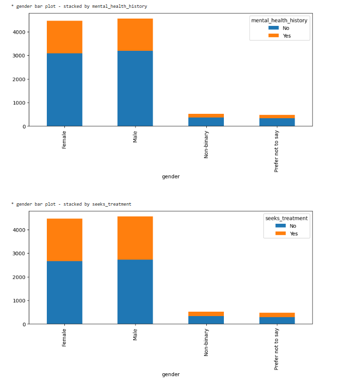
    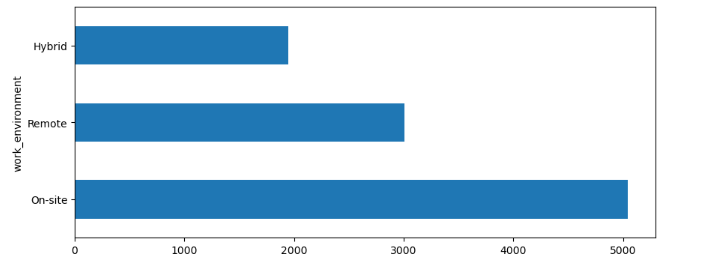
    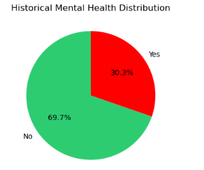
   ##  Insights
 - The bar charts display the distribution of employees gender across key categorical features: `mental_health_risk`, `mental health history`, and `seek treatment`.  
-  **Mental Health Risk:** 59% of the employess have medium risk, while 23.7% pose a high risk.
-  **Gender:** 46% of the employees are Male, 45% are Female and the remaining 9% are non-binary or prefer not to say  
-  **Employment Status:** Most of the respondants are still employed, 20% are student and 10% are currently unemployed.  
-  **Work Environment:** 50% of the respondants work on-site, while 30% work remotely and the remaining 20% work hybrid. 
-   **Mental Health History:** 30% of the respondants acknowledged mental health history.  
 
-  These inital eda and insights helps identify quick and rough trends in the dataset.

   ###  Correlation Heatmap
   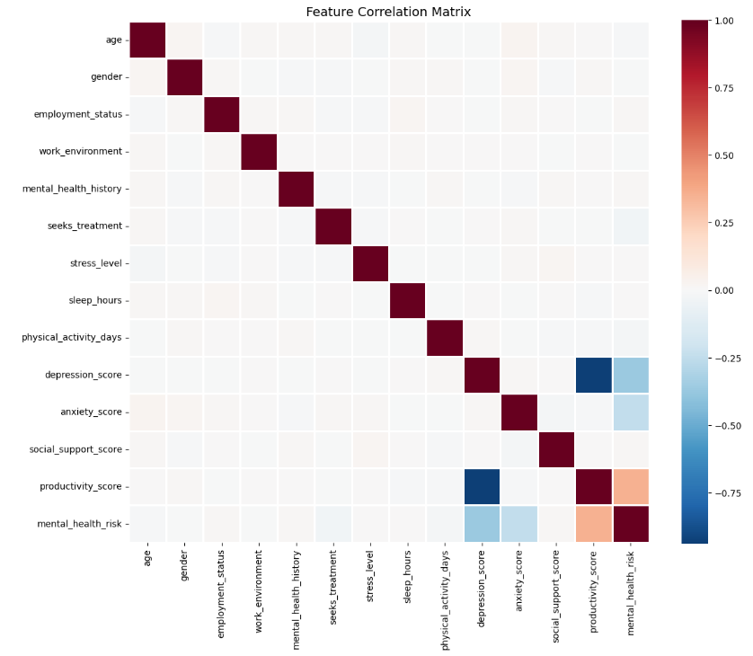
   ## Insights
   **Very Strong Negative Correlations:**
  - `Depression` and `Productivity` (**-0.93**): As depression score increase, productivty score reduces.

-  **Weak Correlations:**
  - `depression score`, `anxiety score`, and `productivity score`, all show very low correlations with `mental healh risk`.

   ###  Sleep Hours
    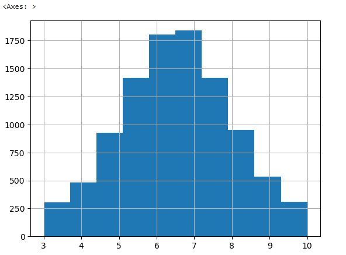
    ## Insights:
    - The histogram shows the sleep pattern of the employees.
    - Sleep hours are more tightly distributed and predictable, with an almost normal distribution. Most patients can be said to have almost a similar sleep pattern at around 6 to 7 hours.

    ###  Sleep Hours v Stress Level
    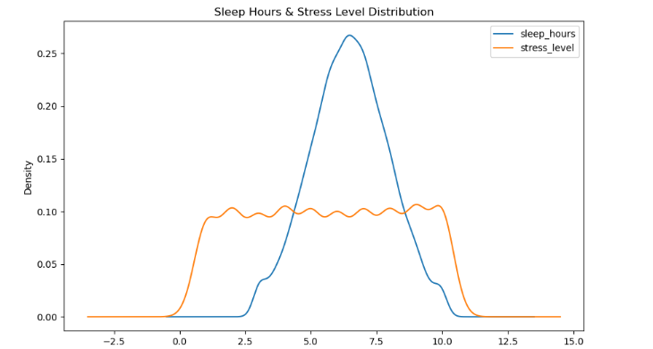
    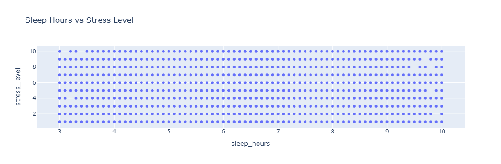
    ## Insights:
    - The KDE shows the sleep  and stress level pattern of the respondants.
    - The overlap does not imply correlation, the plot is only to show 2 different features with similar numerical range.
    - With a correlation coefficient of -0.003352 and the scatter plot above, there is clearly no relationship between the sleep hours and stress level in the dataset

    ###  Depression v Productivity
    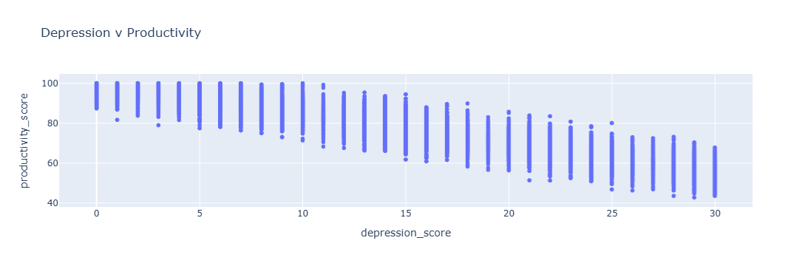
    ## Insights:
    - This clearly shows the inverse relationship between depression and productivity. As depression increases, productivity reduces

    ###  Top 5 correlated features with risk
  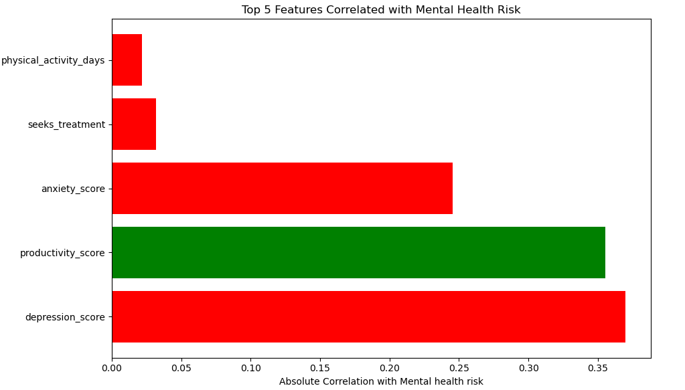

3. **Modelling**  
   - Random Forest Classifier 
   - XGBoost 
   - Evaluation using accuracy, classification report, and confusion matrix  
   - Reflections on performances

   ###  Top 5 important features RF
  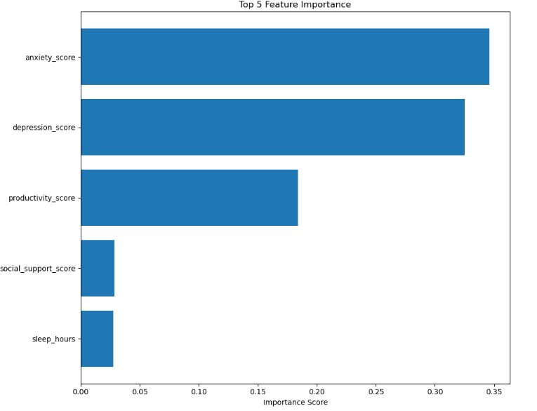

   ###  RF v Hyperparameter
  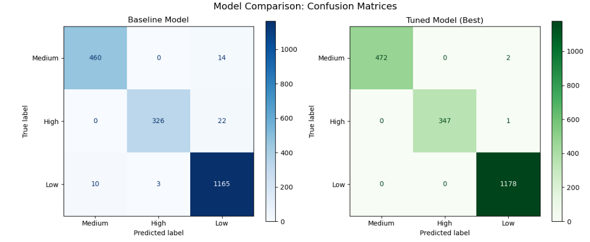

   ###  Model Accuracy
  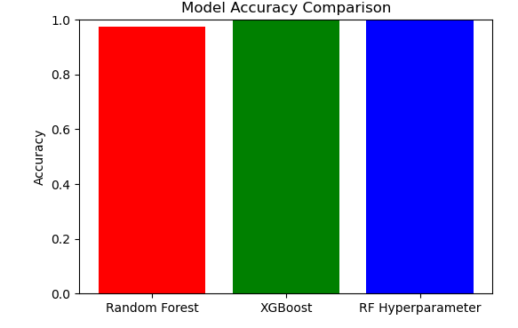
   ### Insight
   MODEL PERFORMANCE:
   - Random Forest achieved 97.5% accuracy
   - Using top 5 features improves performance by 2.2%
   - Tuning improved accuracy by 2.3%
   - XGBoost achieved an accuracy of 100%

4.  **Dashboard & Streamlit App**
    
    - Page 1: EDA and overview
    - Page 2: Predictive interface
    - Page 3: ML models and comparison

###  Key Takeaways

- Dataset: 10000 sample, 58.9% Medium risk of Mental Health, 23.7% High risk of Mental health and 17.4% low chances.
- No missing values
- 45.6% are Male, 44.6% are Female, 5.2% are Non-binary and 4.7% prefers not to mention there gender
- There is no relationship between stress level and sleep hours
- There is also no relationship between productivity and the days spent physically working
- However, there was a clear inverse relationship between productivity and depression score
- The top 5 correlating features to mental health risk at workplace are;
  - depression score
  - productivity score
  - anxiety score
  - seeks treatment
  - physical active days

## Machine Learning Performance

## Reflection on Learning Process

This capstone project has been a significant learning journey, which I thoroughly enjoyed as it pushed me to applying and deepen various skills from revious work experience and skills gathered during the course. 

At first, I was struggling to find the dataset I would like to work on, but after I found out about the ethical process and my lack of in-depth knowledge, I resulted to picking a close dataset. Then I struggled to create meaningful visualisations and in depth analysis. 

These challenges ultimately became learning opportunities that strengthened my technical foundation and problem-solving mindset.

I would continue to work on this project as I know unlimited insights and analysis that can be drawn from it for future adaptation.

### Key Learning Moments

- **Plotly and data visualisation**  
  I utilised a wide range of visualistaion as learned from the course, which I found Plotly as one of my favorite because of the interactiveness capabilities.

- **Git and version control**  
  This project was what I needed to test and improve my Github skills. I made sure I completely relied on VSCode and Github, even with my POwerBI and Tableau knowledge. Using Streamlit allowed me to use VSCode solely and improved my efficiency using Github.

---

## Strategies for Overcoming Challenges

To address challenges, I spent tie understanding the challenge first, then resourced for resolution via various platforms like Stack OverFlow, Youtube and generative AI(Gemini AI), and I also reached out to my peers and tutors at Code Institute

- **Using community resources**  
  Platforms like Stack Overflow, Youtube, gemini generative AI, Google AI response and Neil, one of the code institue mentors were instrumental in resolving errors and understanding best practices.

---

## Bugs Fix & Adaptations
Completely relied and made copy of the data analytics template provided by Code Institue, which helped me enhanced my use of Github.
Neil and other youtube videos assisted in catching bugs, understanding the errors and resolving them. 

## Data cleaning inconsistencies
Learned to use:
df.isnull().sum() 
df.duplicated().sum()
to identify and address missing or duplicate data effectively.

##  Technology Framework

| **Tool / Technology**               | **Purpose**                                                  |
|------------------------------------|--------------------------------------------------------------|
| **Pandas, NumPy, Matplotlib, Seaborn** | Core Python libraries used for data analysis, processing, and basic visualisation. |
| **Plotly**                         | Used for creating interactive and faceted data visualisations in Python. |
| **Streamlit**                       | Used to create an interactive dashboard for visualising and presenting key insights to stakeholders. |
| **GitHub**   | Used for project management, version control, and documenting progress. |

## Deployment & Accessibility

- **Streamlit App**:  
  [Workplace Mental Health – Streamlit (Web Link)](https://https://mentalhealth-across-workplace.streamlit.app/)  
  *An interactive application visualising and predicting risk of mental health given factors acros workplace.*

- **Jupyter Notebook**:  
  [WorkplaceNotebook](notebooks/jupyter_notebooks/workplace mental health.ipynb)  
  *Complete analysis including data cleaning, EDA, visualisations, and machine learning modeling using Python.*

- **GitHub Repository**:  
  [capstone project 2026](https://github.com/MushafauBaba/capstone-project-2026)  
  *generated from Code Institute data analytics template*

##  Credits & Acknowledgments

- **Data Source:** [Mental Health Risk at Workplace (Kaggle)](https://www.kaggle.com/datasets/mahdimashayekhi/mental-health/data)
- **Tools Used:** Python, VSCode, GitHub, Streamlit and Heroku
- **Project Contributors:**  
  Special thanks to my tutor: John at Code Institute, my peers for timely assistance and feedback and mentors Neil, Paul and Emma at Code Institue for their guidance and support throughout this capstone project.

[def]: images/mental.png